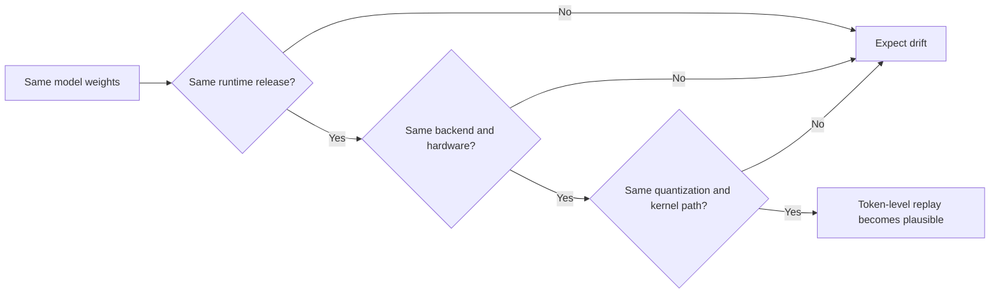

# Deep Research Synthesis for Project Cactus

## Executive summary

This deliverable follows the brief-specific markdown structure rather than the generic fallback format in your prompt. In practice, that means this is a sourcing-first research memo, not a slide deck, code artifact, or experiment notebook. Where the accessible public-source record was thin, I say so explicitly rather than filling gaps with secondary commentary.

The highest-confidence conclusion is that **Ditto is well-supported by public primary sources as the right synchronization substrate for an offline-first, cross-platform mobile prototype**. Its official docs describe mesh synchronization, subscription-driven replication, field-level delta sync optimized for constrained transports such as Bluetooth Low Energy, deterministic CRDT-based conflict resolution, and causal consistency; its public demo apps show iOS and Android implementations for chat, inventory, and POS/KDS-style shared state. citeturn9view1turn29view0turn29view1turn29view3

The strongest risk signal is that **exact output determinism across heterogeneous on-device ML stacks should be treated as a validation objective, not a baseline assumption**. PyTorch explicitly says results are not guaranteed across releases, commits, platforms, or even CPU vs GPU with identical seeds. TensorFlow’s determinism support is explicitly scoped to repeated execution on the *same hardware* with the right settings, and ONNX Runtime’s quantization docs explicitly frame quantization as accuracy-affecting rather than lossless. A very recent arXiv study goes further, showing that inference backend choice alone can materially change outputs and downstream benchmark scores. citeturn19view1turn19view2turn19view3turn23academia2

The pragmatic design implication is that **for a tiny local corpus and short prompts, the retrieval layer should stay simple for as long as possible**. Small embedding models such as `all-MiniLM-L6-v2` and `bge-small-en-v1.5` are lightweight, English-capable, and exposed in ONNX/Transformers form; small instruction models such as **Gemma 3 1B**, **SmolLM2-1.7B-Instruct**, **Qwen2.5-1.5B-Instruct**, and **Llama 3.2 1B Instruct** are all sourceable, but they differ sharply on licensing and deployment friction. For this project, licensing and mobile export compatibility matter at least as much as benchmark scores. citeturn31view0turn33view1turn35view1turn33view0turn37view3turn32view0turn38view0turn39view2turn39view3

The research gap is also real: **there is prior art for decentralized retrieval and decentralized AI memory, but much less for a truly CRDT-native, mergeable, mobile-first vector store that synchronizes over ad hoc peer meshes**. The best adjacent examples I found were DRAG, which distributes RAG over a P2P network, and SHIMI, which proposes decentralized semantic memory with Merkle-DAG and CRDT-style sync ideas. Both are directionally relevant, but neither is the same thing as “Ditto-native local semantic memory on phones.” citeturn24academia0turn25academia1

The determinism constraint can be summarized this way:



That flowchart is not a proposed architecture; it is the shortest accurate summary of what the official runtime docs and current backend-reproducibility research jointly imply. citeturn19view1turn19view2turn19view3turn23academia2

## Top 10 must-read sources

1. **Ditto Syncing Data docs** — the most important source for this project because it documents subscription-based mesh sync, field-level deltas over BLE-constrained links, deterministic CRDT convergence, and causal consistency in one place. citeturn9view1

2. **PyTorch reproducibility note** — the clearest official statement that reproducibility is not guaranteed across releases, platforms, or CPU/GPU paths, which is the right starting point for any “can Cactus be deterministic?” discussion. citeturn19view1

3. **TensorFlow determinism API docs** — useful because they define the strongest officially supported determinism claim in a major framework and also state its limits: same inputs, same hardware, proper seeding, lower performance. citeturn19view2

4. **The Silent Hyperparameter: Quantifying the Impact of Inference Backends on LLM Reproducibility** — the best current research framing for why backend choice itself must be treated as a meaningful experimental variable. citeturn23academia2

5. **Distributed Retrieval-Augmented Generation** — one of the closest public papers to the brief’s “peer-to-peer RAG over decentralized knowledge” requirement. citeturn24academia0

6. **Decentralizing AI Memory: SHIMI** — important because it explicitly combines decentralized semantic memory with Merkle-DAG summaries and CRDT-style synchronization concepts. citeturn25academia1

7. **MediaPipe LLM Inference guide** — the most concrete official source I found tying a small open model family to actual on-device Android/Web deployment formats and backends. citeturn35view1turn35view2

8. **Gemma 3 model card** — the strongest official small-model source among the reviewed candidates because it exposes 1B-specific benchmark rows, context windows, and training-scale details in a directly citable form. citeturn39view3

9. **SmolLM2-1.7B-Instruct model card** — especially valuable because it includes direct head-to-head comparisons against Qwen2.5-1.5B and Llama-1B on instruction-following and rewrite-oriented benchmarks. citeturn37view3

10. **Presenterm GitHub repository** — the best sourceable option for the markdown-to-live-presentation layer because it is mature, feature-rich, and explicitly supports Mermaid, PDF/HTML export, speaker notes, and themes. citeturn12view0

## Per-topic findings

### Embedding and generation determinism

The public-source answer to “can Cactus produce the same embedding vector and same generated response across iPhone, Android, and desktop?” is **not safely yes**. PyTorch’s own documentation says complete reproducibility is not guaranteed across releases, commits, platforms, or CPU/GPU execution even with identical seeds. TensorFlow can enforce deterministic op execution, but only when the same hardware, software environment, and seeds are held constant; by default, it warns that repeated execution can differ because of asynchronous floating-point reduction order, especially on GPUs. ONNX Runtime’s quantization docs reinforce the same practical point from another angle: quantization is not lossless, can degrade accuracy, and needs debugging tools precisely because float and quantized graphs diverge. citeturn19view1turn19view2turn19view3

The newest high-signal adjacent paper makes the risk more concrete: **backend choice alone** can move benchmark scores by double-digit percentages and produce high output disagreement even when weights, decoding parameters, and hardware are otherwise held fixed. That does not prove Cactus behaves the same way, but it strongly suggests the right experimental stance for Cactus is: pin runtime version, pin backend, pin quantization, pin compute unit, and compare with semantic thresholds rather than assuming byte-identical parity across devices. citeturn23academia2

My synthesis for the brief’s determinism question is therefore:

| Scenario | Public-source confidence | Why |
|---|---|---|
| Same device, same runtime version, same backend, same quantization, fixed seed | Highest | This is the narrow regime official frameworks describe as manageable. citeturn19view1turn19view2 |
| Same model across CPU and GPU on the same platform | Low | PyTorch explicitly warns CPU vs GPU may differ even with identical seeds. citeturn19view1 |
| Same model across iPhone, Android, and desktop accelerators | Very low | Official framework docs do not guarantee this, and backend-level research argues the opposite direction. citeturn19view1turn19view2turn23academia2 |
| Same embedding vectors after quantization/export changes | Low | ONNX Runtime explicitly treats quantization as accuracy-affecting and provides debugging APIs for drift. citeturn19view3 |

The practical implication for hackathon evaluation is straightforward: **treat exact equality as a smoke test for a narrowly pinned stack, and use semantic acceptance bands for cross-device parity**. That is the only stance strongly consistent with the available primary-source record. citeturn19view1turn19view2turn23academia2

### CRDT-backed vector index and peer-to-peer RAG

There is real adjacent work here, but not much that is exactly identical to the brief’s target. DRAG is explicitly about **Distributed Retrieval-Augmented Generation** without a centralized knowledge base, using topic-aware peer discovery inside a P2P network to recover near-centralized retrieval quality with lower message cost than flooding. SHIMI is even closer conceptually to local semantic memory: it proposes a hierarchical semantic memory index that is “natively designed for decentralized ecosystems,” with asynchronous synchronization using Merkle-DAG summaries, Bloom filters, and CRDT-style conflict resolution. citeturn24academia0turn25academia1

What I did **not** find in the accessible primary-source set was a widely adopted, mobile-first, **mergeable vector-store implementation** that cleanly answers the brief’s exact question about “CRDT-based vector databases” or “syncing nearest-neighbor indexes directly between replicas.” The strongest sources mostly converge on one pattern instead: synchronize **documents, semantic memory summaries, or retrieval metadata**, not the ANN graph itself. DRAG distributes retrieval across peers; SHIMI synchronizes hierarchical semantic state; Ditto synchronizes CRDT-managed application data. The missing middle is a clean public design for a small, replicated, conflict-resilient vector corpus that lives comfortably on phones. citeturn24academia0turn25academia1turn9view1

That gap is actually good news for novelty. It means the brief’s “cheap, local, syncable semantic memory” concept still looks differentiated, especially if the design keeps the replicated unit closer to **(document, embedding, metadata, version vector)** than to a heavyweight distributed ANN graph. For a tiny corpus, this is also technically attractive because it lets Ditto do what Ditto is already proven to do well: converge structured per-record state with deterministic merge semantics. citeturn9view1turn24academia0turn25academia1

### Ditto and mobile peer alternatives

The strongest public evidence in favor of Ditto is not marketing copy; it is the official mechanics. Ditto’s docs describe real-time, offline-first, peer-to-peer propagation; subscription queries; field-level delta transfer; and deterministic CRDT convergence. They also make an important transport-specific point: field-level deltas are especially beneficial on bandwidth-constrained links such as Bluetooth Low Energy. citeturn9view1

Just as important, Ditto’s public repos are not toy one-platform demos. The **inventory**, **chat**, and **POS/KDS** repositories all expose iOS and Android implementations, and their READMEs frame them as live demonstrations of real-time sync and conflict resolution across platforms. The POS example explicitly says the app works on both iOS and Android and can sync between them. That matters because the brief is not asking for a distributed-systems thought experiment; it is asking for a credible, demoable, ad hoc mobile experience. citeturn29view0turn29view1turn29view3

A second useful signal is newer than many older Ditto writeups: Ditto now publishes an MCP endpoint for its documentation, which means its docs are organized in a way that is already consumable by coding assistants and, by extension, easier to operationalize quickly in a hackathon environment. That does not change network semantics, but it does reduce integration friction. citeturn28view0

On the narrow question of “small peers over BLE/LAN,” the accessible public record points to Ditto as the most sourceable, already-mobile, already-cross-platform option in this project’s shape. I did not find a competing primary-source corpus in this pass that matched Ditto simultaneously on **mobile maturity, offline-first semantics, CRDT conflict handling, and public iOS/Android evidence**. citeturn9view1turn29view0turn29view1turn29view3

### On-device LLM runtimes and candidate small models

Among sourceable runtimes, the clearest official contenders are **ExecuTorch**, **MediaPipe LLM Inference**, **ONNX Runtime GenAI**, and **MLC LLM**.

ExecuTorch is the broadest official “serious mobile deployment” stack in the sources reviewed. Its docs explicitly position it as PyTorch’s edge inference solution, list Android and iOS as supported platforms, expose multiple acceleration backends including Core ML and Qualcomm AI Engine, and include dedicated LLM deployment paths. citeturn34view0

MediaPipe LLM Inference is narrower but very concrete. Its official docs explicitly support lightweight on-device text models, and they specifically document **Gemma-3 1B** and **Gemma-3n** in MediaPipe-ready formats for Android and Web. If the project wants the shortest path from “small model” to “phone demo,” this is one of the strongest source-backed options. citeturn35view1turn35view2

ONNX Runtime GenAI is appealing when heterogeneity matters: the docs expose mobile deployment, Android/iOS builds, and execution providers such as QNN, NNAPI, CoreML, and XNNPACK, plus Snapdragon-specific GenAI tutorials. MLC LLM is compelling when one stack must span iOS, Android, and Web, because its docs expose dedicated iOS and Android SDKs and position the project as a deployment engine meant to optimize and ship models across platforms. citeturn36view1turn36view2turn36view3turn35view4turn35view5

For models, the best publicly sourceable small-model picture from this pass is:

| Model | License posture | Best source-backed strength | Main caveat |
|---|---|---|---|
| **Gemma 3 1B** | Gemma terms, not Apache/MIT. citeturn39view1turn39view2 | Excellent official 1B benchmark disclosure and direct MediaPipe support for Android/Web. citeturn39view3turn35view1 | License/redistribution restrictions are more involved than Apache-2.0. citeturn39view1 |
| **SmolLM2-1.7B-Instruct** | Apache-2.0. citeturn33view0 | Strong small-model head-to-head results on IFEval and OpenRewrite-style rewriting; explicitly described as lightweight enough for on-device use. citeturn37view3turn32view3 | Slightly larger than 1B-class options. |
| **Qwen2.5-1.5B-Instruct** | Apache-2.0. citeturn32view0 | Broad ecosystem support; easy quantized downstream path. citeturn32view1 | The model card pushes detailed evals out to external Qwen materials rather than embedding the full table inline. citeturn37view1 |
| **Llama 3.2 1B Instruct** | Llama 3.2 community license. citeturn38view0 | Huge runtime ecosystem and broad quantization support. citeturn38view0 | License obligations and access gating are meaningfully more complex for an open hackathon handoff. citeturn38view0 |

Two benchmark-related details are especially relevant to the brief’s task type. First, **SmolLM2’s model card directly reports OpenRewrite-Eval along with IFEval and MT-Bench**, which makes it the best documented proxy in this source set for “list normalization / rewrite / merge-ish” tasks among the tiny models. Second, **Gemma 3 1B’s official card is the strongest single source for a 1B-class model with transparent benchmark rows**, and MediaPipe makes it unusually operationalizable. citeturn37view3turn39view3turn35view1

### Embeddings, vector search, and tiny-corpus retrieval

For embeddings, the most obvious low-friction candidates are still the classics. `all-MiniLM-L6-v2` produces 384-dimensional dense vectors and is explicitly packaged for PyTorch, TensorFlow, Rust, ONNX, and OpenVINO with an Apache-2.0 license. `bge-small-en-v1.5` is MIT-licensed, English-oriented, and also exposed in ONNX/Transformers form. Both are strong fits for a small, English-first recipe or ingredient corpus. citeturn31view0turn33view1

The decisive issue is not whether these models *can* work; it is whether the project needs ANN at all at stage zero. For the brief’s stated order of magnitude — a tiny local corpus, not millions of vectors — the public-source record points toward **keeping retrieval exact and simple first**. Qdrant’s own benchmark page is useful here not because you should adopt Qdrant Cloud for a 5k-item phone corpus, but because it shows that even on a 1M-vector benchmark, fast engines are already in the low-single-digit-millisecond range on controlled hardware. If million-scale search is already that fast on a server-class benchmark, then at ≤5k items the project should force ANN to justify its operational complexity rather than importing it by habit. That is an inference, but it is a strong one. citeturn55view0

A compact comparison:

| Candidate embedding model | Dimensionality / format clues | License | Why it fits this brief |
|---|---|---|---|
| `all-MiniLM-L6-v2` | 384-dim; ONNX + TF + Rust + OpenVINO exposed in model card. citeturn31view0 | Apache-2.0. citeturn31view0 | Very portable, tiny, mature, English-first, easy to export. |
| `bge-small-en-v1.5` | ONNX + Transformers exposed in model card. citeturn33view1 | MIT. citeturn33view1 | Strong retrieval-oriented family and permissive license. |

And for datasets already present in the strongest primary sources, the most relevant *proxy* evaluation sets are:

| Dataset / benchmark | What it measures | Why it is only a proxy here |
|---|---|---|
| IFEval | Instruction-following quality in instruction-tuned LLMs. citeturn37view3turn39view3 | Useful for “follow merge constraints,” but not recipe-specific. |
| OpenRewrite-Eval | Rewrite quality. citeturn37view3 | Better proxy for list consolidation than generic chat benchmarks, but still not ingredient merging. |
| FACTS Grounding | Factual grounding. citeturn39view3 | Relevant to retrieval-augmented answers, not merge quality. |
| dbpedia-openai-1M benchmark set | Vector-search latency / accuracy comparisons. citeturn55view0 | Retrieval-systems benchmark, not domain-quality benchmark. |

The main gap remains unchanged: I did **not** find a ready-made, sourceable benchmark specifically for “merge two structured ingredient or shopping lists under short context constraints.” That is one of the most important open evaluation holes in the brief. 

### Local-first AI prior art

The best primary-source cluster I found that actually rhymes with the brief is not a single polished “local-first AI product,” but a triangle:

- **Ditto demo apps** show real mobile-first, cross-platform local replication behavior. citeturn29view0turn29view1turn29view3
- **DRAG** shows that retrieval can be redistributed over a decentralized network instead of concentrated in a central store. citeturn24academia0
- **SHIMI** shows how semantic memory can be structured and synchronized with decentralized CRDT-style machinery. citeturn25academia1

That triangle is not the same as “consumer local-first AI note app,” but it is arguably more relevant to this project’s technical identity. It suggests a credible framing for demos and future writeups: **local-first AI is not only about private note-taking with a local model; it is also about peer-native memory, local retrieval, and syncable semantic state**. citeturn24academia0turn25academia1turn29view0

### Latency floors and why the tiny local path matters

The broad latency story strongly favors local-first retrieval for this project size. There are at least three floors that stack against a cloud round trip. First, long-haul internet paths are bounded by route length and the speed of light in fiber; one widely cited rule of thumb in the networking literature is line-of-sight distance multiplied by roughly 2.1, then divided by the speed of light in fiber, with substantial room for inflation from routing and conduit realities. citeturn45view0

Second, real mobile links introduce their own variability. A real-world 5G transport evaluation for mobile AR reported a **median 5G RTT of about 15.09 ms** for TCP in its setup, even before any application-layer retrieval or generation work is done. That is not “bad,” but it is also not free. citeturn47view0

Third, cloud vector systems are fast but still not zero-latency. Pinecone’s public homepage currently advertises **12 ms P50 with filters** and **150 ms P90 at 2.8B vectors**, and its own UI prominently surfaces p50/p95/p99 request-latency monitoring. Qdrant’s published benchmark page reports **3.54 ms latency and 8.62 ms p99** for one 1M-vector benchmark configuration on controlled hardware, while explicitly warning that its benchmark suite is comparative and potentially biased toward what Qdrant knows best. The important point is not that one vendor wins universally. The point is that even excellent remote retrieval still adds transport and tail-latency exposure that a 5k-item local corpus does not need to pay. citeturn53view0turn55view0

Finally, the most recent edge-inference paper in this source set reinforces a non-obvious deployment truth: **thermal stability can matter more than peak throughput on phones**. Under sustained load, mobile LLM throughput can degrade sharply. That says the right target for the brief is probably not “maximum benchmark speed,” but “tight, bounded, user-visible latency for a very small task.” citeturn43academia3

### Presentation tooling

Presenterm is the strongest sourceable answer for the brief’s “markdown-first presentation tool” requirement. Its repository README explicitly says it supports markdown slide decks, images and animated GIFs, highly customizable themes, code highlighting, Mermaid graph rendering, PDF/HTML export, automatic reload, and speaker notes; the repo also shows a mature release history with **23 releases** and **v0.16.1** marked latest on February 20, 2026. citeturn12view0

That combination is unusual: it gives you a repo that is hackable like a CLI tool, a deck that remains diffable like docs, and enough presentational affordances to do a live demo without moving into heavyweight GUI slideware. For the brief’s tone — technical, local, reproducible, terminal-friendly — it is an unusually good fit. citeturn12view0

## Tool shortlist

The table below intentionally prioritizes **high-confidence, source-backed candidates** over exhaustive coverage.

| Category | Candidate | Primary source | License / terms | Platform signals | Footguns | Verdict |
|---|---|---|---|---|---|---|
| Mesh sync layer | **Ditto** | Official docs + public iOS/Android demo apps. citeturn9view1turn29view0turn29view1turn29view3 | Commercial / vendor-managed platform. | Explicit iOS + Android evidence in public demo repos. citeturn29view0turn29view1turn29view3 | Requires app/account setup and platform provisioning. | **Use it.** This is the strongest, most directly relevant source-backed substrate in the stack. |
| On-device LLM runtime | **ExecuTorch** | Official docs. citeturn34view0 | PyTorch ecosystem tooling. | Android + iOS + multiple accelerator backends. citeturn34view0 | Export/lowering pipeline complexity. | **Maybe.** Best if the model/export path is already PyTorch-native. |
| On-device LLM runtime | **MediaPipe LLM Inference** | Official docs. citeturn35view1turn35view2 | Google tooling; model terms vary by model. | Android + Web; direct Gemma support in `.task` / `.litertlm`. citeturn35view1turn35view2 | Narrower model/menu than generic runtimes. | **Use it** if Gemma 3 1B / Gemma 3n is acceptable. |
| On-device LLM runtime | **ONNX Runtime GenAI** | Official docs. citeturn36view1turn36view2turn36view3 | Open-source runtime; model licenses vary. | Android/iOS/mobile EPs plus Snapdragon-specific docs. citeturn36view1turn36view2turn36view3 | Export, EP selection, and quantization/debugging overhead. | **Maybe.** Attractive if Snapdragon and heterogeneous backends matter. |
| On-device LLM runtime | **MLC LLM** | Official docs. citeturn35view4turn35view5 | Open-source project. | iOS SDK + Android SDK + Web stack. citeturn35view4turn35view5 | Compiler/toolchain complexity. | **Maybe.** Best for one-codebase multi-platform demos when compiler expertise is available. |
| Small LLM | **Gemma 3 1B** | Official model card + MediaPipe docs. citeturn39view3turn35view1 | Gemma terms. citeturn39view1turn39view2 | Strongest official “small + mobile-ready” story in this pass. | Terms more restrictive than Apache/MIT. | **Use it** if Google terms are acceptable and Android/Web path is the priority. |
| Small LLM | **SmolLM2-1.7B-Instruct** | Official model card. citeturn33view0turn37view3 | Apache-2.0. citeturn33view0 | Explicitly described as lightweight enough to run on-device. citeturn32view3 | Slightly larger memory/thermal cost than 1B models. | **Use it** if licensing simplicity matters and you want a strong rewrite/instruction proxy. |
| Small LLM | **Qwen2.5-1.5B-Instruct** | Official model card. citeturn32view0turn37view1 | Apache-2.0. citeturn32view0 | Good ecosystem portability and quantized downstream path. citeturn32view1 | Eval evidence in the card is less self-contained than SmolLM2/Gemma. | **Maybe.** Strong open-license fallback. |
| Small LLM | **Llama 3.2 1B Instruct** | Official model card/license page. citeturn38view0 | Llama 3.2 community license. citeturn38view0 | Excellent downstream tooling and quantization ecosystem. | License obligations and access gating. | **Maybe, leaning no** for a friction-sensitive hackathon handoff. |
| Embedding model | **all-MiniLM-L6-v2** | Official model card. citeturn31view0 | Apache-2.0. citeturn31view0 | ONNX/TF/Rust/OpenVINO exposure is unusually portable. citeturn31view0 | Lower ceiling than larger retrievers. | **Use it** as the lowest-friction baseline. |
| Embedding model | **bge-small-en-v1.5** | Official model card. citeturn33view1 | MIT. citeturn33view1 | ONNX/Transformers-ready; retrieval-focused family. citeturn33view1 | English-first small variant may cap headroom on harder semantic distinctions. | **Use it** as the main alternative baseline. |
| Presentation framework | **Presenterm** | Official repo. citeturn12view0 | BSD-2-Clause. citeturn12view0 | Terminal-native, markdown-first, Mermaid/PDF/HTML export. citeturn12view0 | Terminal rendering varies by environment. | **Use it.** It is the brief’s best-fitting presentation tool in this pass. |

## Reference architectures

These are not prescriptions to copy wholesale. They are the closest public artifacts that show *pieces* of the intended experience.

| Project | Why it rhymes with the brief | What to steal conceptually |
|---|---|---|
| **getditto/demoapp-chat** | Public iOS + Android peer-synced messaging app built on Ditto. citeturn29view0 | Presence, subscription patterns, and the minimal “two nearby peers immediately share state” story. |
| **getditto/demoapp-inventory** | Demonstrates conflict resolution and real-time counters across iOS and Android. citeturn29view1 | The merge semantics for “small mutable shared state” and the visible-presence mesh demo pattern. |
| **getditto/demoapp-pos-kds** | Cross-platform location-scoped shared state with real-time updates in an applied workflow. citeturn29view3 | The idea that a location or context can scope which records propagate to which peers. |
| **DRAG** | Decentralized retrieval over a P2P network, with topic-aware peer discovery instead of centralized RAG. citeturn24academia0 | Query routing and the argument that distributed retrieval can remain useful without a central vector store. |
| **SHIMI** | Decentralized semantic memory with Merkle-DAG summaries, Bloom filters, and CRDT-style sync. citeturn25academia1 | A stronger conceptual frame for “sync semantic memory, not just documents.” |

## Open research questions

The largest unresolved question is the one the brief itself puts at center stage: **where are the actual public Cactus docs, repo, and model catalog?** In the accessible public-source set reviewed here, I did not get a sourceable official Cactus corpus robust enough to anchor claims about Cactus-specific determinism, acceleration backends, supported models, or measured on-device latency. That means several “Cactus-specific” assertions in the brief remain adjacent in this memo rather than directly substantiated.

The next set of open questions is more technical than documentary:

- **What exact determinism target is acceptable?** Token-identical replay across heterogeneous devices is unlikely to be robustly attainable without extreme pinning; semantic or task-equivalence thresholds may be the right acceptance criteria. citeturn19view1turn19view2turn23academia2
- **Does the project need ANN at all below ~5k items?** The public-source record reviewed here suggests “probably not initially,” but that should be confirmed with a simple latency/quality bakeoff once the real corpus is fixed. citeturn55view0
- **Which small-model benchmark best predicts “ingredient-list merge” quality?** None of the strongest primary sources expose a benchmark perfectly aligned to that task. IFEval and OpenRewrite-Eval are helpful proxies, not final answers. citeturn37view3turn39view3
- **How much sustained-load thermal drift is acceptable on target phones?** Peak demos can flatter tiny on-device LLMs; sustained interaction is the tougher bar. citeturn43academia3
- **Where are the publicly comparable p50/p99 cloud vector API numbers for all target vendors?** Pinecone publishes useful latency signals and Qdrant publishes open benchmarks, but an apples-to-apples, vendor-neutral cloud-API comparison remains sparse in the reviewed primary-source set. citeturn53view0turn55view0

## Source ledger

```text
https://docs.ditto.live/key-concepts/syncing-data
https://docs.ditto.live/home/mcp-integration
https://github.com/getditto/demoapp-inventory
https://github.com/getditto/demoapp-chat
https://github.com/getditto/demoapp-pos-kds
https://docs.pytorch.org/docs/2.12/notes/randomness.html
https://www.tensorflow.org/api_docs/python/tf/config/experimental/enable_op_determinism
https://onnxruntime.ai/docs/performance/model-optimizations/quantization.html
https://arxiv.org/abs/2605.19537
https://arxiv.org/abs/2505.00443
https://arxiv.org/abs/2504.06135
https://docs.pytorch.org/executorch/stable/index.html
https://ai.google.dev/edge/mediapipe/solutions/genai/llm_inference
https://onnxruntime.ai/docs/genai/
https://llm.mlc.ai/docs/
https://huggingface.co/sentence-transformers/all-MiniLM-L6-v2
https://huggingface.co/BAAI/bge-small-en-v1.5
https://huggingface.co/HuggingFaceTB/SmolLM2-1.7B-Instruct
https://huggingface.co/Qwen/Qwen2.5-1.5B-Instruct
https://huggingface.co/meta-llama/Llama-3.2-1B-Instruct
https://huggingface.co/google/gemma-3-1b-it
https://ai.google.dev/gemma/docs/core/model_card_3
https://ai.google.dev/gemma/terms
https://github.com/mfontanini/presenterm
https://www.pinecone.io/
https://qdrant.tech/benchmarks/
https://arxiv.org/abs/1811.10737
https://arxiv.org/abs/2006.02859
https://arxiv.org/abs/2603.23640
```

## What the CLI agents would have missed

- **Ditto now exposes an MCP endpoint for its docs** at `docs.ditto.live/mcp`, which is not central to the sync engine itself but is a meaningful velocity signal for a hackathon workflow. citeturn28view0
- **PyTorch and TensorFlow are aligned on the core determinism warning**: both frameworks narrow deterministic guarantees to tightly controlled conditions rather than cross-device parity, which makes “same outputs everywhere” a much riskier assumption than it first sounds. citeturn19view1turn19view2
- **MediaPipe’s docs are unusually concrete about tiny mobile models**, including `Gemma-3 1B` and `Gemma-3n` in deployable formats, which makes the Gemma path much more operational than a generic “small model on phone” discussion would suggest. citeturn35view1turn35view2
- **SmolLM2’s model card is more informative than most small-model cards** because it embeds a direct four-way comparison against Qwen2.5-1.5B and Llama-1B on IFEval, MT-Bench, OpenRewrite-Eval, and several reasoning tasks. citeturn37view3
- **Pinecone’s own homepage is already telling a local-vs-cloud story indirectly**: it exposes p50/p95/p99 observability in-product and advertises both a 12 ms P50 filtered-search case and a 150 ms P90 large-scale case, which is fast but still materially above a tiny on-device lookup that avoids the network entirely. citeturn53view0
- **Qdrant’s benchmark page is unusually honest for vendor-published performance material** because it both publishes p95/p99 numbers and explicitly acknowledges that the benchmark may be biased toward what Qdrant knows best. That warning itself is useful signal when comparing vector engines. citeturn55view0
- **The strongest local-first AI prior art in this pass was not a polished note app, but a combination of Ditto demos plus decentralized-RAG papers**, which suggests the project narrative should lean into *syncable semantic memory* rather than only “AI on device.” citeturn24academia0turn25academia1turn29view1