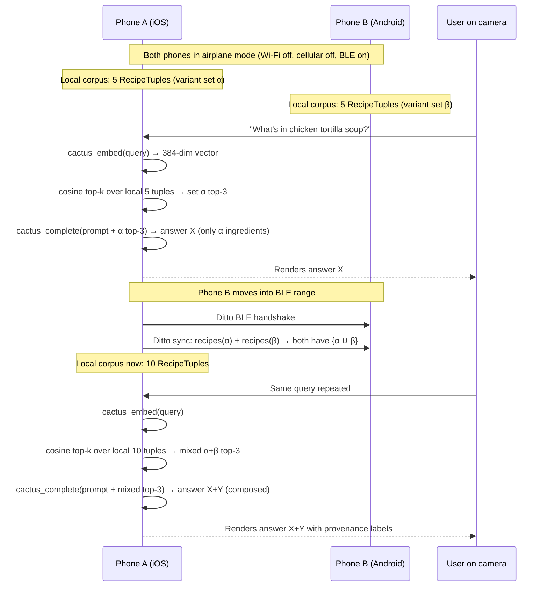

# Mesh RAG Stage 0 — Two-Device P2P RAG Demo (Ditto × Cactus, Flutter)

## Summary

Ship Stage 0 as a single Flutter dual-target app (iOS + Android) with Cactus held narrow to on-device embedding + small-LLM inference and Ditto carrying the full grow-only-CRDT sync + storage. Two early spikes — cross-platform embedding parity and recipe-merge LLM quality — run before the main pipeline so a corpus-or-fallback decision is in hand by mid-Day-1. Retrieval is brute-force cosine top-k over a flat float32 array; the demo's moment of magic is airplane mode toggled live on camera, with phone A's answer visibly changing after phone B comes into BLE range.

---

## Problem Frame

Pain and motivation live in [SEED.md](../../SEED.md) ("Why This Exists"). In one line: today every RAG architecture assumes a central vector store; an existence-proof of a peer-to-peer RAG where the index *is* a CRDT collapses that assumption and gives Ditto + Cactus a concrete shared story. The plan honors the SEED.md thesis (latency + offline-first, not cost) and the future-work arc in [docs/research/index/open-questions.md](../research/index/open-questions.md) (Stage 0 ships generalist + flat union; specialists / preference-aware / adversarial filtering / generational drift are writeup-only).

---

## Requirements

Traced to SEED.md's Holdout Scenarios. Each R-ID is a SEED.md holdout we must pass (or explicitly defer if Stage 1+).

- **R1.** Airplane-mode moment of magic on camera: phone A query returns answer X; phone B comes into BLE range; same query on phone A returns X+Y visibly drawing on phone B's tuples. *(SEED Holdout 1; primary demo deliverable.)*
- **R2.** Cross-platform embedding determinism: identical text → cosine ≥ 0.999 across iOS and Android. *(SEED Holdout 2; load-bearing — if this fails, the CRDT merge is meaningless.)*
- **R3.** Sync idempotence: re-meeting after no changes produces no duplicate tuples, no top-k drift. *(SEED Holdout 3.)*
- **R4.** Bidirectional merge observable through queries: notes pushed from A appear in B and vice versa. *(SEED Holdout 4.)*
- **R5.** Cold-load latency: first answer on the slowest target device in under ~10s after app start. *(SEED Holdout 5.)*
- **R6.** End-to-end offline: full demo runs with Wi-Fi off, cellular off, only BLE/LAN. *(SEED Holdout 7.)*
- **R7.** Stage 0 ship criterion: R1 + R2 + R3 + R4 + R5 + R6 all pass on the chosen hardware in a single recorded take.
- **R-stretch.** Audience-survivable Stage 1 query (Holdout 6 in SEED). Deferred — not in Stage 0 scope.

---

## Scope Boundaries

- No production UI polish, settings panels, error toasts, persistent chat history, streaming token output.
- No cloud fallback / Cactus hybrid mode. Excluded by thesis.
- No document ingestion plumbing (PDF, EPUB, archives). Stage 2 only if Sunday runway.
- No multi-user identity / authentication / access control on the synced corpus.
- No HNSW, IVF, PQ, or any approximate-nearest-neighbor index. Flat float32 array is the Stage 0 answer.
- No retrieval reranking, query rewriting, multi-hop retrieval, fancy chunking.
- No code addressing the future-work arc (specialists / preference-aware / adversarial filtering / generational evolution). All writeup-only.

### Deferred to Follow-Up Work

- Stage 1 audience-participation submission UI (corpus grows from ~5 to ~50/device; audience picks queries) — natural follow-up once Stage 0 ships.
- Stage 2 real-corpus integration (notes app contents, PDF library on one device) — Sunday-only if Stages 0–1 ship.
- iOS background BLE for "always-on" mesh — environmental constraint not solvable at user-app scope per research; acknowledged in writeup.

---

## Context & Research

### Relevant Code and Patterns

**No in-repo patterns** — this is a greenfield Flutter project. The external reference architectures from [docs/research/index/top-N.md](../research/index/top-N.md#8-dittopos--ditto-inventory-demo-apps--official-cross-platform-reference) carry the patterns:

- [`inspiration/repos/getditto__demoapp-pos-kds/`](../../inspiration/repos/getditto__demoapp-pos-kds/) and [`inspiration/repos/getditto__demoapp-inventory/`](../../inspiration/repos/getditto__demoapp-inventory/) — Ditto's official cross-platform iOS+Android demo apps. Mirror their peer-discovery UX, mesh-state visualization, and CRDT-merge presentation shape.
- [`inspiration/repos/permissionlesstech__bitchat/`](../../inspiration/repos/permissionlesstech__bitchat/) and [`inspiration/repos/permissionlesstech__bitchat-android/`](../../inspiration/repos/permissionlesstech__bitchat-android/) — 2025-current cross-platform BLE-mesh chat. Reference for mesh-state UX affordances and foregrounding requirements outside the Ditto stack.
- [`inspiration/repos/deepsense-ai__edge-slm/`](../../inspiration/repos/deepsense-ai__edge-slm/) — Android-native on-device RAG pipeline (Phi-2 / TinyLlama + gte). Mirror the chunking → embedding → retrieval → prompt-assembly path; we graft Ditto in on top.
- [`inspiration/repos/ramanujammv1988__edge-veda/`](../../inspiration/repos/ramanujammv1988__edge-veda/) — Flutter managed on-device AI runtime with worker isolate. Closest Flutter-side reference; copy the source-attribution UX (when retrieved tuples come from another device, render them as "from <peer>").
- [`inspiration/repos/software-mansion-labs__react-native-rag/`](../../inspiration/repos/software-mansion-labs__react-native-rag/) — modular embeddings / vector-store / LLM interface seams. Copy the seam shapes; we back them with Cactus instead of ExecuTorch.

### Institutional Learnings

No `docs/solutions/` yet (greenfield). Project-specific decisions captured in:

- [SEED.md](../../SEED.md) — Open Questions (Resolved) carry the corpus-theme, hardware-mix, connectivity-reveal, and thesis-durability decisions.
- [docs/research/index/clusters.md](../research/index/clusters.md) — full cluster map.
- [docs/research/future-work-research.md](../research/future-work-research.md) — Step-4.5 primary sources for the three writeup-only future-work threads.

### External References

- [docs/research/index/top-N.md](../research/index/top-N.md) — 12 ranked must-read sources. Start here.
- [docs/research/claude.md](../research/claude.md) — highest-signal Mode-B worker output; full Cactus + Ditto integration findings + Llama/Gemma licensing + latency-floor argument.
- [Thinking Machines Lab — "Defeating Nondeterminism in LLM Inference"](https://thinkingmachines.ai/blog/defeating-nondeterminism-in-llm-inference/) — load-bearing for the determinism spike approach (batch=1, INT4, fixed reduction kernel).
- [Cactus engine docs](https://github.com/cactus-compute/cactus/blob/main/docs/cactus_engine.md) — primary source on `cactus_embed`, `cactus_index_*`, `cactus_rag_query`. Explicitly states no determinism guarantees.
- [Ditto SDK docs](https://docs.ditto.live/) — official mesh + transport + DQL documentation.

---

## Key Technical Decisions

- **Flutter dual-target over native Swift+Kotlin.** Single codebase reaches both phones; Cactus and Ditto both ship official Flutter packages. Halves the implementation cost and matches existing user familiarity per [IDEA-A.md](../../IDEA-A.md).

- **Cactus narrow (embed + LLM only); Ditto owns persistence; we own retrieval.** Don't use `cactus_rag_query` or `cactus_index_*` for Stage 0 — Cactus's vector index would want to own its own storage and would fight Ditto's CRDT-merged tuple set. Instead: every device calls `cactus_embed(query)` → runs a Dart-side cosine top-k over the float32 vectors materialized from a Ditto DQL query → passes the top-k tuples + the query to `cactus_complete` for synthesis. This is also what [open-questions.md §1.4](../research/index/open-questions.md) flags as the Day-1 spike default.

- **Brute-force cosine over a flat float32 array.** At ≤5k tuples × 384 dims = 7.7 MB, exact-recall brute force is sub-millisecond, CRDT-trivial (no index state to merge), and sidesteps the HNSW-under-concurrent-replica-inserts correctness problem entirely. USearch / sqlite-vec are documented escape hatches if we ever cross 10k tuples — not in Stage 0.

- **Embedding model: EmbeddingGemma 300M primary, Qwen3-Embedding-0.6B (Apache-2.0) backup.** EmbeddingGemma is best-in-class under 500M on MTEB and Cactus packages it; Qwen3 is the cleanest license and also Cactus-packaged. Final lock is the determinism spike's output (whichever passes cosine ≥ 0.999 cross-platform first).

- **Small LLM: Qwen 2.5 1.5B Instruct primary, SmolLM2 1.7B Apache-2.0 backup.** Qwen 2.5 1.5B is Apache-2.0 (cleanest license for a public hackathon repo), Cactus-packaged, and at the right scale for our latency budget. Final lock is the recipe-merge eval's output. **Avoid Llama 3.2** because the Community License's "Built with Llama" attribution + naming requirements add public-repo friction we don't need.

- **Quantization: pin to INT4 (Q4_K_M) on the same backend on both phones.** Research finding (arXiv 2602.17099 + Thinking Machines Lab): INT4 quantized paths are dramatically more reproducible across hardware than FP16/BF16. Pinning the backend to CPU on both devices (no ANE / Hexagon dispatch in Stage 0) maximizes the chance of cosine ≥ 0.999.

- **Spike-first risk reduction.** The two empirical gates (U2 determinism + U3 LLM merge quality) run *before* the main pipeline so we have hard go/no-go data by mid-Day-1. U2 failure → pivot to brainstorm option C (no determinism dependency). U3 failure → swap corpus from recipes to cars per SEED.md gating clause.

- **Test posture: integration-shaped, not test-pyramid.** Hackathon scope is "ship the moment of magic on camera." SEED.md holdouts are the source of truth for verification; per-unit "Verification" outcomes describe what an implementer checks by hand. No formal unit-test coverage targets.

- **Demo deliverable shape per [SEED.md Open Questions §6](../../SEED.md)**: primary = working repo + Presenterm slide deck; recorded video + blog post are stretch.

---

## Open Questions

### Resolved During Planning

- **Platform stack?** Resolved: Flutter dual-target. See Key Technical Decisions.
- **Cactus integration shape?** Resolved: Cactus narrow + own cosine. See Key Technical Decisions.
- **Which embedding model?** Resolved-with-spike: EmbeddingGemma primary, lock after U2.
- **Which small LLM?** Resolved-with-spike: Qwen 2.5 1.5B primary, lock after U3.
- **Quantization?** Resolved: INT4 / Q4_K_M, same backend tier both phones.

### Deferred to Implementation

- **Exact Cactus Flutter package version and API method names.** Cactus moves fast; lock at U1 scaffold time by reading the current `pubspec.yaml`-resolvable version. The plan references conceptual operations (`cactus_embed`, `cactus_complete`) — implementer uses whichever method names the resolved Cactus version exposes.
- **Exact Ditto Flutter package version + DQL syntax for the recipe collection.** Same — lock at U1, write a `dql_queries.dart` constants file once the SDK version is known.
- **Final demo recipe set.** The 5 recipes per device are filled in just before rehearsal (U9) so they read on camera as a *real* chicken-tortilla-soup variant rather than placeholder text.
- **Whether to demo with airplane mode toggled live (high credibility) or with a pre-recorded fallback take.** Resolution depends on dry-run reliability. SEED.md preference is live toggle; pre-record only as B-roll fallback.
- **BLE peer-discovery timing on the specific hardware.** Ditto docs note "several seconds per initiation"; exact behavior is hardware-specific. Rehearsal at U9 measures it; demo pacing is set from observed values.

---

## Output Structure

The plan creates a new Flutter project at the repo root. Expected layout — directional, not constraint; implementer may adjust:

```
.
├── pubspec.yaml                         # Flutter deps incl. ditto_live, cactus
├── lib/
│   ├── main.dart                        # App entry, initialize Ditto + Cactus
│   ├── models/
│   │   └── recipe_tuple.dart            # RecipeTuple data class + (de)serialization
│   ├── services/
│   │   ├── ditto_service.dart           # Init, sync start, subscriptions, CRUD over RecipeTuple
│   │   ├── cactus_service.dart          # Init model, embed(), complete()
│   │   └── retrieval_service.dart       # Cosine top-k over a Dart Float32List
│   ├── widgets/
│   │   ├── query_screen.dart            # Single text-box query + answer pane
│   │   └── mesh_status_widget.dart      # "Connected peers: N" indicator
│   └── prompts/
│       └── recipe_merge.dart            # Prompt template for "synthesize from variants"
├── scripts/
│   ├── determinism_spike.dart           # U2 — embed identical text both phones, dump first-N components
│   └── recipe_merge_eval.dart           # U3 — feed 5 variants to candidate LLMs, rank outputs
├── assets/
│   ├── seed_recipes_a.json              # 5 chicken-tortilla-soup variants for phone A
│   └── seed_recipes_b.json              # 5 chicken-tortilla-soup variants for phone B
├── slides/
│   ├── deck.md                          # Presenterm Markdown deck
│   └── media/                           # Demo screenshots, before/after-sync stills
└── docs/plans/2026-05-21-001-feat-mesh-rag-stage-0-implementation-plan.md   # this file
```

---

## High-Level Technical Design

> *This illustrates the intended approach and is directional guidance for review, not implementation specification. The implementing agent should treat it as context, not code to reproduce.*

### Demo-flow sequence (the moment of magic)



### Dependency graph between implementation units

```
            ┌──────── U1 Scaffold ────────┐
            │           │                  │
            ▼           ▼                  ▼
        U2 Spike   U3 Spike            U4 Ditto
        (determ)   (LLM eval)          (schema+sync)
            │           │                  │
            └──┬────────┘                  │
               ▼                           │
       U5 Retrieval ◄─────────────────────┘
               │
               ▼
       U6 Synthesis
               │
               │      ┌── U7 Mesh sync ◄── U4
               ▼      ▼
            U8 Demo UI
               │
        ┌──────┴───────┐
        ▼              ▼
   U9 Rehearsal   U10 Slides
```

---

## Implementation Units

### U1. Flutter scaffold + Cactus + Ditto SDK wiring

**Goal:** Empty-but-runnable Flutter app on both phones with Cactus and Ditto packages resolved, model files downloaded on first launch, and a placeholder screen that confirms both SDKs initialize without crashing.

**Requirements:** Prerequisite for all other units; no R-IDs directly.

**Dependencies:** None.

**Files:**
- Create: `pubspec.yaml`, `lib/main.dart`, `lib/services/ditto_service.dart` (stub), `lib/services/cactus_service.dart` (stub), `.gitignore` updates for Flutter (`.dart_tool/`, `build/`, `ios/Pods/`, etc.)
- Modify: `README.md` — add brief "what is this" + run instructions

**Approach:**
- Run `flutter create` to scaffold.
- Add Cactus Flutter package and Ditto Flutter package as dependencies. Lock the exact resolved versions into `pubspec.yaml`.
- Initialize Cactus on app start (download default model on first launch with a progress indicator). Initialize Ditto with an offline-only / online-playground identity (no big-peer cloud). Start sync.
- A single placeholder screen renders "Cactus: ready / Ditto: peers=N" so the implementer knows both SDKs initialized.

**Patterns to follow:** Mirror `inspiration/repos/getditto__demoapp-inventory` for Ditto init shape; mirror `inspiration/repos/ramanujammv1988__edge-veda` for Cactus init + worker-isolate pattern.

**Test scenarios:**
- *Happy path:* App boots on iOS device, "Cactus: ready / Ditto: peers=0" appears within 10s after first-launch model download completes.
- *Happy path:* App boots on Android device, same outcome.
- *Edge case:* Second launch (model already cached) → "Cactus: ready" appears within 2s.

**Verification:**
- Both phones boot the app without crash.
- Both phones display "Cactus: ready" after the model is on disk.
- Both phones display "Ditto: peers=1" when in BLE range of each other (no app logic yet — Ditto's sync.start is enough).

---

### U2. SPIKE — Cross-platform embedding determinism

**Goal:** Empirically confirm or refute that `cactus_embed("chicken tortilla soup")` produces cosine ≥ 0.999 across iOS and Android with the same Q4-quantized embedding model on CPU backend. This is the load-bearing experiment for **R2**.

**Requirements:** R2.

**Dependencies:** U1.

**Files:**
- Create: `scripts/determinism_spike.dart` — runs on both phones, embeds the same fixture string, dumps the first 16 components + the full 384-dim vector to a per-device JSON file.
- Create: `scripts/determinism_compare.dart` (host-side, can run on macOS) — reads the two JSONs, computes cosine + L2, prints pass/fail vs threshold ≥ 0.999.

**Approach:**
- Pin both phones to: same Cactus version + same GGUF/Q4_K_M weights + CPU backend (explicitly disable Metal / ANE on iOS, disable NNAPI / Hexagon on Android).
- Fixture: 5 short strings of varying lengths (1, 10, 50, 200, 500 chars). All 5 must hit cosine ≥ 0.999.
- Add a debug button to the Cactus init screen: "Run determinism spike" → writes the JSON to app docs dir + AirDrop/adb-pull to the host.

**Execution note:** This is a measurement spike. The output is a yes/no decision, not new feature behavior. Treat as throwaway code; no test coverage.

**Test scenarios:**
- *Outcome — pass:* All 5 fixtures hit cosine ≥ 0.999 on the first try with default Cactus settings → lock the embedding choice + backend config; proceed to U5.
- *Outcome — borderline (0.99 ≤ cosine < 0.999):* Try swapping EmbeddingGemma ↔ Qwen3-Embedding-0.6B. Re-test. If still borderline, accept the lower threshold and document in SEED.md as a known constraint; proceed.
- *Outcome — fail (cosine < 0.99):* Two further attempts — (a) lock to Cactus CPU backend with single-threaded scheduling per Thinking Machines Lab's batch-invariance recipe; (b) try smaller embedding (Nomic Embed v1.5 137M). If both fail, **pivot Stage 0 to brainstorm option C** (Narrate the mesh — does not depend on cross-platform embedding determinism). Surface this to the user before proceeding.

**Verification:**
- A `docs/spikes/U2-determinism-results.md` exists with: cosine score per fixture, chosen embedding model, backend config locked in, pass/fail/pivot decision recorded with date and rationale.

---

### U3. SPIKE — Recipe-merge LLM eval (corpus-choice gate)

**Goal:** Empirically confirm or refute that an off-the-shelf small LLM (≤ 3B) can coherently synthesize a normalized recipe from 5 heterogeneous chicken-tortilla-soup variants. This gates the corpus choice per [SEED.md Open Questions (Resolved) §1](../../SEED.md).

**Requirements:** R1 (indirectly — gates whether recipes is the demo corpus).

**Dependencies:** U1.

**Files:**
- Create: `scripts/recipe_merge_eval.dart` — feeds a fixed prompt + 5 variants to each candidate LLM (Qwen 2.5 1.5B, SmolLM2 1.7B, optionally Phi-3 Mini); writes output text per model.
- Create: `assets/eval_recipes_chicken_tortilla.json` — 5 hand-picked variants of one dish, chosen to have moderate ingredient overlap and at least one polarizing ingredient (e.g., avocado).
- Create: `docs/spikes/U3-recipe-merge-eval.md` — eval rubric (coherence 1–5, ingredient-recall 1–5, ingredient-deduplication 1–5, instruction-clarity 1–5) and per-model scores.

**Approach:**
- Run the eval on one phone (the more capable one — likely iPhone). Eval doesn't need cross-device parity.
- Score each model output by the rubric. The threshold for "use recipes corpus": at least one candidate scores ≥ 3.0 average across the rubric on at least 3 of 5 audience-likely queries.
- If no model clears the bar → fall back to **cars corpus** per SEED.md gating clause. Cars are descriptive, not generative-merge-shaped, so even the smallest model handles them.

**Execution note:** Measurement spike. Outcome is a corpus-and-model decision.

**Test scenarios:**
- *Outcome — pass:* At least one candidate clears 3.0/5 rubric average → lock that LLM + recipes corpus.
- *Outcome — fail:* Switch corpus to cars; lock the smallest candidate LLM that produces coherent answer-from-context.

**Verification:**
- `docs/spikes/U3-recipe-merge-eval.md` has per-model scores, chosen LLM, chosen corpus, decision recorded with date.

---

### U4. Ditto integration — `RecipeTuple` schema + local CRUD + subscription

**Goal:** A working Ditto integration that can store, query, and observe `RecipeTuple` documents locally, with subscriptions wired so query results auto-refresh when the underlying collection changes (via local writes or sync).

**Requirements:** R3 (sync idempotence — Ditto handles natively but verify), R4 (bidirectional merge), R5 (cold load), R6 (offline).

**Dependencies:** U1.

**Files:**
- Create: `lib/models/recipe_tuple.dart` — Dart class matching the SEED.md / RESEARCH-BRIEF.md inline schema: `{ id: UUID, dish: String, contributor: String, ingredients: List<String>, steps: List<String>, embedding: List<double>, createdAt: DateTime }`. Serializer/deserializer for Ditto document shape.
- Create: `lib/services/ditto_service.dart` — methods: `initialize()`, `addRecipe(RecipeTuple)`, `subscribeToRecipes(callback)`, `queryAll()`, `peerCount stream`.
- Create: `lib/prompts/dql_queries.dart` — string constants for the DQL `SELECT * FROM recipes`, `INSERT INTO recipes ...`, subscription query.
- Create: `assets/seed_recipes_a.json`, `assets/seed_recipes_b.json` — 5 RecipeTuples each (without embeddings — embeddings are computed at first-launch insert).
- Test: `test/integration/ditto_local_crud_test.dart` — exercises insert / query / subscription locally (no second device).

**Approach:**
- Use Ditto's standard collection + subscription model. `recipes` is a Ditto collection; `RecipeTuple` is a Ditto document.
- Document IDs are UUIDs generated client-side at insert time. Ditto's grow-only-by-default semantics handle the merge — no special CRDT plumbing required.
- On first launch: read `seed_recipes_a.json` (or `_b.json` based on a build-time `PHONE_ROLE` env var) → insert each via `addRecipe`. Computing the embedding column is U5's job; U4 leaves it empty for now.

**Patterns to follow:** `inspiration/repos/getditto__demoapp-inventory/` for collection / subscription shape.

**Test scenarios:**
- *Happy path:* Insert 5 RecipeTuples on first launch; `queryAll()` returns 5.
- *Happy path:* Subscribe to recipes; insert one more; subscription callback fires with 6.
- *Edge case:* Second launch (recipes already in Ditto store) — no duplicate inserts. Idempotence via deterministic UUIDs derived from `(contributor, dish, createdAt)` so re-running seed insert is a no-op.
- *Integration:* `peerCount stream` emits 0 when alone, ≥1 when other device is in BLE range.

**Verification:**
- Both phones show 5 recipes in their local store on second launch.
- Both phones report `peerCount=1` when in BLE range; `peerCount=0` when separated.

---

### U5. Cactus embedding + retrieval pipeline

**Goal:** Given a query string, the app calls `cactus_embed(query)`, materializes the current corpus from Ditto, runs a flat-array cosine top-k, and returns the top-k tuples in score order. Embedding column on each RecipeTuple is populated lazily on first read.

**Requirements:** R1 (the "answer" half — retrieve before synthesize), R2 (depends on U2 lock-in), R5 (cold-load latency budget allocation).

**Dependencies:** U2 (locks embedding model + backend), U4 (Ditto collection exists).

**Files:**
- Create: `lib/services/retrieval_service.dart` — methods: `embedQuery(String) → Float32List`, `topK(query, k) → List<(RecipeTuple, double)>` where the second value is cosine similarity, `ensureEmbeddings()` to lazily fill missing embeddings on Ditto rows.
- Modify: `lib/models/recipe_tuple.dart` — the `embedding` field is now write-on-first-read; mutate the Ditto document with the computed embedding once.
- Modify: `lib/services/cactus_service.dart` — add `embed(String) → Future<Float32List>`.
- Test: `test/integration/retrieval_test.dart` — embed-and-rank fixture.

**Approach:**
- `ensureEmbeddings()` runs on app start after Ditto init: iterate all rows where `embedding` is empty, compute, write back.
- `topK` materializes `embedding` columns into a single contiguous `Float32List` (N × 384 floats), then a simple dot-product loop (vectors are L2-normalized by Cactus, so dot product = cosine).
- k=3 default for Stage 0. Configurable.
- Performance budget: full top-k over 5k tuples should finish in < 10ms on iPhone, < 30ms on a mid-range Android. At Stage 0 corpus size (10 tuples) it's microseconds.

**Patterns to follow:** Brute-force cosine pattern from `inspiration/repos/deepsense-ai__edge-slm/` (Android implementation, easily portable to Dart).

**Test scenarios:**
- *Happy path:* Embed a query that's lexically close to one of the 5 seed recipes → that recipe ranks top-1 with cosine > 0.7.
- *Happy path:* Embed a query that's lexically distant → top-1 cosine < 0.5; result still consistent across repeat calls.
- *Edge case:* `topK` on an empty corpus returns empty list (does not crash).
- *Edge case:* `topK` with k larger than corpus size returns all rows in score order.
- *Integration:* `ensureEmbeddings()` populates embedding column; Ditto subscription on a peer sees the embedded rows when they sync.

**Verification:**
- On a phone with 5 preloaded recipes, querying "soup with chicken" returns the chicken-tortilla recipe at top-1 with score visible in debug logs.
- All 5 seed recipes have non-empty embedding columns within 30s of first launch.

---

### U6. Cactus LLM synthesis hookup

**Goal:** Given a query and top-k retrieved RecipeTuples, the app calls `cactus_complete` with a prompt that asks the LLM to synthesize a normalized merged recipe. Returns the answer string with light source-attribution rendering ("from <contributor>" labels next to ingredients that came from each retrieved tuple).

**Requirements:** R1.

**Dependencies:** U3 (locks LLM choice), U5 (retrieves top-k).

**Files:**
- Modify: `lib/services/cactus_service.dart` — add `complete(prompt, maxTokens) → Stream<String>` for token-by-token streaming (UX); a non-streaming `completeAll` is fine if streaming Cactus integration is fiddly.
- Create: `lib/prompts/recipe_merge.dart` — prompt template: system message that says "Synthesize a single coherent recipe from these variants. Note where they disagree. Prefer ingredients that appear in multiple variants." Followed by retrieved tuples in a structured form.
- Modify: `lib/services/retrieval_service.dart` — add a higher-level `answerQuery(String query) → Stream<String>` that orchestrates embed → top-k → prompt-assembly → complete.
- Test: `test/integration/end_to_end_test.dart` — query → answer fixture.

**Approach:**
- Prompt template is deliberately simple — no chain-of-thought, no critique step. The LLM gets the query + top-3 tuples + the synthesis instruction.
- Source attribution: post-process the LLM output to detect ingredient mentions that overlap with retrieved tuples; render those with subtle "(from <contributor>)" suffixes in the UI.

**Patterns to follow:** Prompt shape from `inspiration/repos/software-mansion-labs__react-native-rag/` (their RAG prompt template). Source-attribution UX from `inspiration/repos/ramanujammv1988__edge-veda/`.

**Test scenarios:**
- *Happy path:* Query "chicken tortilla soup" on a phone with 5 chicken-tortilla variants → answer is a coherent merged recipe (judged by hand against the U3 rubric).
- *Edge case:* Query with no relevant retrieved tuples (top-1 cosine < 0.3) → answer either says "I don't know" or generates from prior alone. The prompt should encourage the former; verify by hand.
- *Edge case:* LLM streaming partial result is renderable mid-token (no UTF-8 corruption mid-codepoint).
- *Integration:* Cold-load to first-token latency on the slowest device < 10s (R5 verification surface — actual measurement happens at U9 rehearsal).

**Verification:**
- One known-good query returns a coherent merged recipe on the slowest device in < 10s first-token, < 30s full answer.

---

### U7. Mesh sync verification — 2-device end-to-end

**Goal:** Confirm that with two devices in BLE range, recipes added on phone A appear in phone B's local store (and vice versa), idempotently, and a query on either device after sync reflects the union of both corpora. This is the holdout test for R3 and R4.

**Requirements:** R3, R4, R6.

**Dependencies:** U4 (Ditto sync wired), U5 (embedding column populated for synced rows).

**Files:**
- Create: `scripts/sync_verification.dart` — a debug-menu screen that exposes: "Insert recipe", "Trigger ensureEmbeddings", "Show peer count", "Show local recipe count", "Toggle airplane mode hint".
- Create: `docs/spikes/U7-sync-verification.md` — checklist + observed timings for the dry runs.

**Approach:**
- Verification is procedural, not a unit test — observe behavior across two real devices.
- Procedure:
  1. Both phones in airplane mode. Confirm `peerCount=0`, both have only their seed corpus (5 each).
  2. Turn off airplane mode (BLE-only — turn Wi-Fi back off after BLE confirms). Confirm `peerCount=1` within ~10s.
  3. Confirm both phones show `localRecipeCount=10` within ~30s.
  4. Run query "chicken tortilla soup" on phone A; verify retrieved top-3 includes rows whose `contributor` field is phone B's identity.
  5. Re-enter airplane mode on both phones. Run same query — retrieved top-3 still includes phone B's rows (the sync persisted).
  6. Cold-restart both phones, both in airplane mode. Verify each phone's local store still has 10 rows. Verify queries still return correct top-k.
  7. Repeat handshake — confirm no duplicate rows appear (idempotence check for R3).

**Patterns to follow:** N/A — this is a procedural verification.

**Test scenarios:**
- *Outcome — pass:* All 7 procedure steps observe the expected behavior. Mark R3, R4, R6 as verified.
- *Outcome — sync slow:* Step 3 takes > 90s. Investigate BLE transport configuration in Ditto — likely need to enable LAN transport too, not BLE-only.
- *Outcome — duplicates:* Step 7 shows duplicates. Investigate the `addRecipe` idempotence path; likely the UUID is not deterministic across re-runs.

**Verification:**
- `docs/spikes/U7-sync-verification.md` updated with observed peer-count timing, sync-completion timing, idempotence-check result, and final pass/fail per holdout.

---

### U8. Demo UI — query input, before/after-sync view, mesh-state indicator

**Goal:** A minimal, on-camera-legible UI: one text input, one answer pane, one mesh-status indicator ("connected to N peers"), and a subtle "answer drew on N tuples (M from peers)" attribution line. Optimized for the demo, not for production.

**Requirements:** R1 (the on-camera moment of magic depends on the UI clearly showing the answer change).

**Dependencies:** U5, U6, U7.

**Files:**
- Create: `lib/widgets/query_screen.dart` — full-screen Stateless+Stream widget that wraps query input, streaming answer pane, and the source-attribution footer.
- Create: `lib/widgets/mesh_status_widget.dart` — top-bar pill showing peer count + a colored dot (green=connected, gray=alone).
- Modify: `lib/main.dart` — wire `QueryScreen` as the root route.
- Modify: `lib/prompts/recipe_merge.dart` — the prompt asks the LLM to mark each ingredient with `[from <contributor>]` inline so post-processing can render attribution.

**Approach:**
- Big input field, big "ask" button, big answer pane. No nav, no settings, no chat history.
- The "answer changes after sync" effect is what the demo lives or dies on — verify visually that re-issuing the same query produces a visibly different answer pre-vs-post-sync.
- The mesh-status pill must be visible in the recording frame at all times so the audience sees the transition "alone → connected" coincide with the answer change.

**Patterns to follow:** Source-attribution UX from `inspiration/repos/ramanujammv1988__edge-veda/`. Mesh-state pill from `inspiration/repos/permissionlesstech__bitchat/` / `bitchat-android`.

**Test scenarios:**
- *Happy path:* Same query before and after sync produces visibly different answers; UI renders them both legibly at arm's length on camera.
- *Happy path:* Mesh-status pill updates within 2s of peer count change.
- *Edge case:* Streaming answer renders mid-token without UI flicker.
- *Edge case:* Query while peer-count=0 still works (uses only local corpus); demo can still narrate "this is the alone case."
- *Edge case:* Pressing "ask" twice rapidly doesn't double-fire the LLM.
- *Integration:* End-to-end: open app, type query, see answer; bring second phone close; re-type same query; see different answer.

**Verification:**
- Hand-test: full demo flow on two phones, eyeballed for camera-legibility.
- Phone A's answer changes between pre-sync and post-sync runs of the identical query.

---

### U9. Demo rehearsal — preload, airplane-mode toggle, recording prep

**Goal:** Multiple end-to-end rehearsals of the demo, with airplane-mode toggled live on camera (per SEED.md decision §3). Capture a backup pre-recorded take as B-roll insurance. Final corpus loaded and frozen.

**Requirements:** R7 (Stage 0 ship criterion — all R1–R6 pass in a single recorded take).

**Dependencies:** U8.

**Files:**
- Modify: `assets/seed_recipes_a.json`, `assets/seed_recipes_b.json` — final 5+5 recipes; chosen for ingredient overlap that makes the merge visibly composed.
- Create: `docs/spikes/U9-demo-rehearsal.md` — rehearsal log + final take notes.
- Create: `slides/media/` — screenshots of the before/after-sync states for the deck.

**Approach:**
- Three rehearsals minimum. Record each. Watch back; identify weakest moment; fix in U8 if needed.
- Set the camera for the final take: both phones in frame, mesh-status pills visible, hand visible toggling airplane mode.
- If BLE flakiness shows up in rehearsal, pre-record the airplane-mode-toggle moment as B-roll and verbally narrate it during the live take.

**Execution note:** Less code, more iteration on the demo flow itself. Plan ≤ half a day of focused rehearsal time.

**Test scenarios:**
- *Outcome — green:* One full take of the demo, on camera, with R1 + R2 + R3 + R4 + R5 + R6 visibly passing.
- *Outcome — flake:* If BLE handshake takes > 10s on demo hardware, B-roll fallback is rehearsed and ready.

**Verification:**
- A single recorded take exists at `slides/media/demo-take-final.mov` (or similar) that ships in the deck.

---

### U10. Presenterm slide deck

**Goal:** A Presenterm-rendered Markdown deck that frames the demo: the thesis ("your knowledge base wants to be a CRDT"), the architecture (one diagram), the before/after-sync result (live or B-roll), the latency/offline-first durability argument, and the four-thread future-work arc gestured at the end.

**Requirements:** Out of scope for SEED.md holdouts, but explicit in SEED.md's deliverable list.

**Dependencies:** U8 (need screenshots), U9 (need recording).

**Files:**
- Create: `slides/deck.md` — Presenterm Markdown.
- Create: `slides/media/` — screenshots, recording, the Mermaid architecture diagram exported to PNG.
- Create: `slides/notes.md` — speaker notes per slide.

**Approach:**
- Lean on the writeup arc from [open-questions.md §2](../research/index/open-questions.md) and the four-thread future-work narrative.
- Structure:
  1. Title + one-line thesis
  2. The problem with cloud RAG: physics-bound latency + offline-impossible
  3. The CRDT insight: vector index as grow-only set
  4. Architecture diagram (the U5 sequence diagram, simplified)
  5. Live demo (or B-roll)
  6. What this is + what it isn't (Stage 0 scope honesty)
  7. The four-thread future-work arc — closing pitch
  8. Q&A / contact slide

**Patterns to follow:** Presenterm exemplar deck at `inspiration/repos/mfontanini__presenterm/examples/demo.md` (Step 3 download may have skipped this — fetch ad-hoc if missing).

**Test scenarios:**
- *Happy path:* `presenterm slides/deck.md` renders all 8 slides without errors.
- *Happy path:* PDF export via `presenterm --export-pdf` produces a shareable artifact.

**Verification:**
- A dry-run of the deck takes ≤ 10 minutes with comfortable pacing.
- The deck and the recording are both committed to the repo.

---

## System-Wide Impact

- **Interaction graph:** The retrieval and synthesis layers depend on the Cactus model staying loaded across queries; the Ditto subscription drives UI refresh; airplane-mode toggle is a hardware-level affordance the app must merely *not* crash on.
- **Error propagation:** Cactus model load failure → app shows "Cactus: failed" on the init screen and aborts query; Ditto sync failure → mesh-status pill stays gray; LLM generation failure → answer pane shows error text. No silent retries in Stage 0.
- **State lifecycle risks:** RecipeTuple embedding column is filled lazily — if the embedding compute is interrupted, the row is left in a partially-embedded state. `ensureEmbeddings()` must be idempotent and recover.
- **API surface parity:** Same Flutter codebase on iOS + Android — no per-platform branches except where Cactus or Ditto Flutter packages diverge (e.g., model-file path conventions). Lock those at U1.
- **Integration coverage:** R2's cross-platform parity, R3's idempotence, and R4's bidirectional merge are not provable by unit tests — they require two real devices. U7 is the integration-coverage holdout.
- **Unchanged invariants:** None — greenfield project; nothing to preserve.

---

## Risks & Dependencies

| Risk | Mitigation |
|------|------------|
| **U2 fails: cross-platform embedding cosine < 0.999.** Load-bearing risk for the CRDT-merge thesis. | Spike-first sequencing means we know by mid-Day-1. Pivot to brainstorm option C ("Narrate the mesh") which has no determinism dependency. |
| **U3 fails: small LLM can't coherently merge recipes.** Demo's "moment of magic" gets weaker. | Fall back to cars corpus per SEED.md gating clause — descriptive Q&A doesn't need merge quality. |
| **Cactus Flutter package API churn.** Cactus moves fast; current docs may not match resolved version. | U1 locks the version in `pubspec.yaml`. Plan references conceptual operations; implementer adapts to the resolved API. |
| **Ditto BLE handshake flakiness on demo hardware.** Could blow up the on-camera take. | U9 captures B-roll as fallback insurance; rehearse the verbal narration that paves over a 10s handshake. |
| **Model file size on first launch.** Embedding + LLM models could be 1–3 GB combined — first-launch download might be slow on hotel Wi-Fi. | Pre-warm models before the demo (run app once with internet; verify they're cached). U1 includes the progress indicator so the implementer knows when it's ready. |
| **iOS background BLE.** Apps backgrounded mid-demo would drop the mesh. | Keep both apps foregrounded; rehearsal includes "don't touch the home button" as a procedural step. |
| **Llama license accidentally enters the repo.** "Built with Llama" attribution required if Llama weights are redistributed. | Decision is to default to Qwen 2.5 1.5B (Apache-2.0); only swap to Llama if both Qwen and SmolLM2 fail U3 eval. |
| **Cosine threshold ≥ 0.999 is too strict.** Real-world cross-platform float-determinism may settle around 0.99–0.995. | Plan accepts ≥ 0.99 as borderline-pass (per U2 outcome paths). Adjust threshold in SEED.md if needed. |

---

## Documentation / Operational Notes

- **README.md update:** add a one-paragraph "what this is + how to run" section once U1 lands, so a fresh clone is buildable.
- **Spike docs:** U2 (`docs/spikes/U2-determinism-results.md`), U3 (`docs/spikes/U3-recipe-merge-eval.md`), U7 (`docs/spikes/U7-sync-verification.md`), U9 (`docs/spikes/U9-demo-rehearsal.md`) — each captures the empirical decision made and the date.
- **License audit before publishing the repo:** check `pubspec.yaml` resolution for the actual LLM + embedding model weights' license stamps. Surface anything that requires attribution or notice. Apache-2.0 is the target.
- **Demo-day operational notes:** Pre-flight checklist — both phones charged > 80%, both in airplane mode, both apps launched and warm, model files cached. The U9 rehearsal log doubles as this checklist.

---

## Sources & References

- **Origin document:** [SEED.md](../../SEED.md)
- **Companion research:** [RESEARCH-BRIEF.md](../../RESEARCH-BRIEF.md), [docs/research/index/README.md](../research/index/README.md), [docs/research/index/top-N.md](../research/index/top-N.md), [docs/research/index/open-questions.md](../research/index/open-questions.md), [docs/research/future-work-research.md](../research/future-work-research.md)
- **Mode-B worker outputs (highest signal first):** [docs/research/claude.md](../research/claude.md), [docs/research/codex.md](../research/codex.md), [docs/research/gemini.md](../research/gemini.md)
- **Idea doc:** [IDEA-A.md](../../IDEA-A.md) (parent hackmd: <https://hackmd.io/@alyssaditto/rkeKeeaJzg>)
- **Manifest:** [docs/research/downloads.yaml](../research/downloads.yaml) — 178 entries, 76 done, 85 pending (triaged + Step-4.5 additions)
- **External primary sources cited in plan:**
  - [Thinking Machines Lab — Defeating Nondeterminism in LLM Inference](https://thinkingmachines.ai/blog/defeating-nondeterminism-in-llm-inference/)
  - [Cactus engine docs](https://github.com/cactus-compute/cactus/blob/main/docs/cactus_engine.md)
  - [Ditto SDK docs](https://docs.ditto.live/)
  - [MobileRAG (arXiv 2507.01079)](https://arxiv.org/abs/2507.01079) — measured on-device RAG latency
  - [EmbeddingGemma (arXiv 2509.20354)](https://arxiv.org/abs/2509.20354) — primary embedding candidate
  - [Presenterm](https://github.com/mfontanini/presenterm) — slide-deck framework
